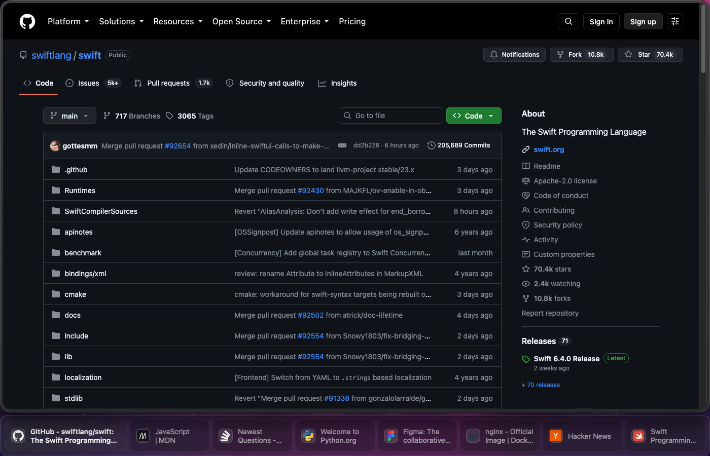
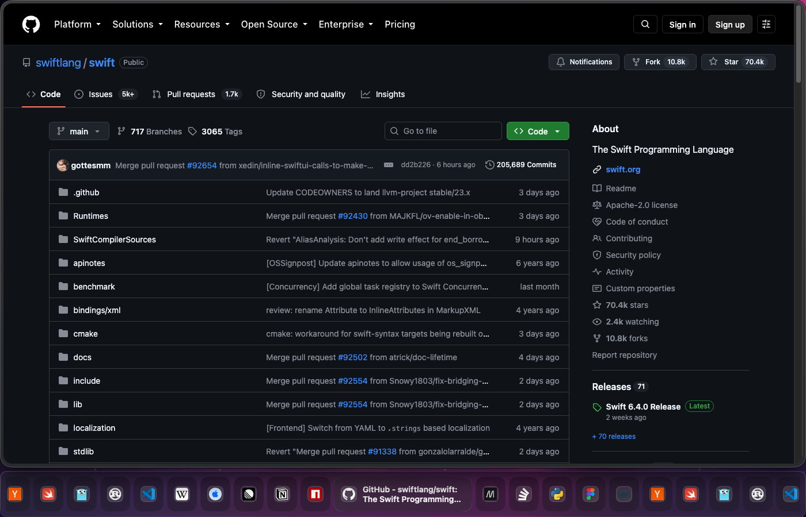
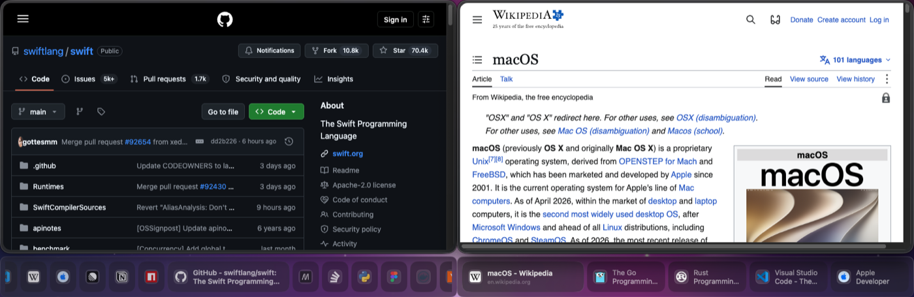
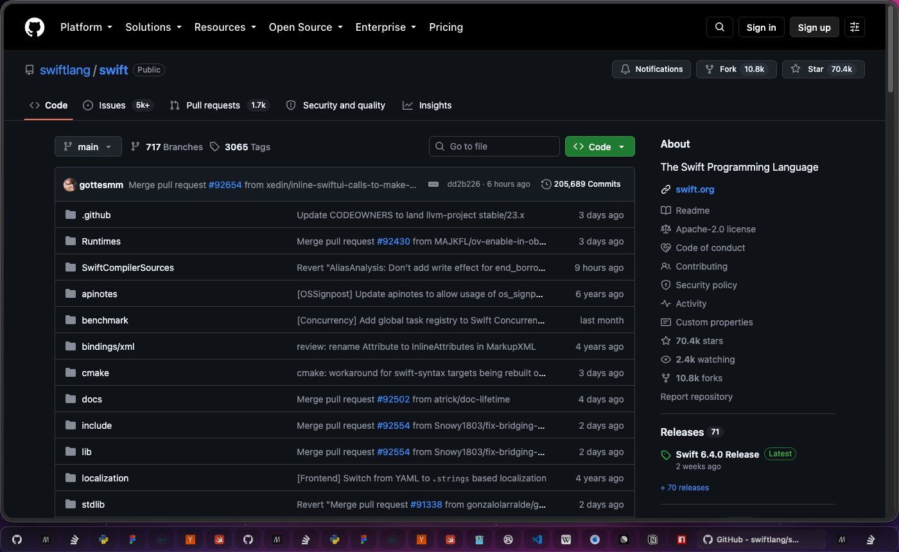

# Polaska



A glass tab strip for your browser, pinned under the window on macOS.

Polaska turns off your browser's built-in tab bar and draws the tabs in a
separate panel that lives right under the browser window — where macOS glass is
real and the desktop shows through it. It is not a widget or an add-on; it is a
replacement for the tab bar.

Free. No account, no analytics, no telemetry.

## Install

```bash
brew install servitola/tap/polaska
```

Or download the disk image from **[Releases](../../releases/latest)** and drag
Polaska to Applications. The build is signed with a Developer ID and notarized
by Apple.

Polaska updates itself: it checks this repository's feed and offers the new
version in its menu bar item. Homebrew leaves the installed copy to that
updater.

On first launch macOS asks for the **Accessibility** permission — Polaska needs
it to follow the browser window as you move, resize, hide or minimize it.

## Requirements

- macOS 26 or later, Apple Silicon
- A Chromium browser (Vivaldi, Chrome, Edge, Brave, Arc, Opera) or a Gecko one
  (Zen, Firefox)
- The Polaska browser extension — it is what tells the app which tabs you have

**The extension is not in the browser stores yet.** Until it is published the
app has nothing to draw, so today this release is useful only if you already
have the extension. This page will link to the store listing as soon as it
exists.

## What it looks like


*Fifty tabs — neighbours shrink to icons, the active one stays wide.*


*Every visible browser window gets its own strip; the focused one is brighter.*


*The standard layout. There is a spacious one too, and the strip can sit on any
of the four edges.*

## Something broken? Missing something?

Open an issue: **[Issues](../../issues)**

That is the support channel — bug reports, questions, and feature requests all
go there. Please say which browser and which macOS version you are on; the
Polaska version is in the menu bar item.

## Privacy

Nothing about you leaves your Mac. There is no Polaska account, no analytics,
no telemetry, no advertising. The extension talks to the app over a local
socket on your own machine. The app makes exactly one kind of outgoing request —
asking this repository whether a newer version of Polaska exists.

The full privacy policy will be published here before the extension reaches the
stores.

## About this repository

This repository holds the **releases, the update feed, and the issue tracker**.
The source code is developed privately and is not published here.

---

## По-русски

Стеклянная полоска вкладок под окном браузера на macOS. Родная таб-строка
браузера выключается — полоска её заменяет.

Бесплатно, без учётной записи, без аналитики и телеметрии.

Установка: `brew install servitola/tap/polaska` или образ из
[Releases](../../releases/latest). Сборка подписана Developer ID и нотаризована
Apple, обновляется сама. При первом запуске macOS попросит доступ в
«Универсальный доступ» — без него полоска не сможет следовать за окном.

Нужно: macOS 26 или новее на Apple Silicon, браузер на Chromium (Vivaldi,
Chrome, Edge, Brave, Arc, Opera) или Gecko (Zen, Firefox) и расширение Polaska.
**Расширения в магазинах пока нет** — до его публикации приложению нечего
показывать, и сегодня эта сборка полезна только тем, у кого расширение уже
стоит.

Что-то сломалось или чего-то не хватает — в [Issues](../../issues): это и есть
канал поддержки. Напишите, какой у вас браузер и версия macOS; версия Polaska
видна в пункте строки меню.

В этом репозитории лежат только сборки, лента обновлений и трекер задач.
Исходный код разрабатывается приватно и здесь не публикуется.
